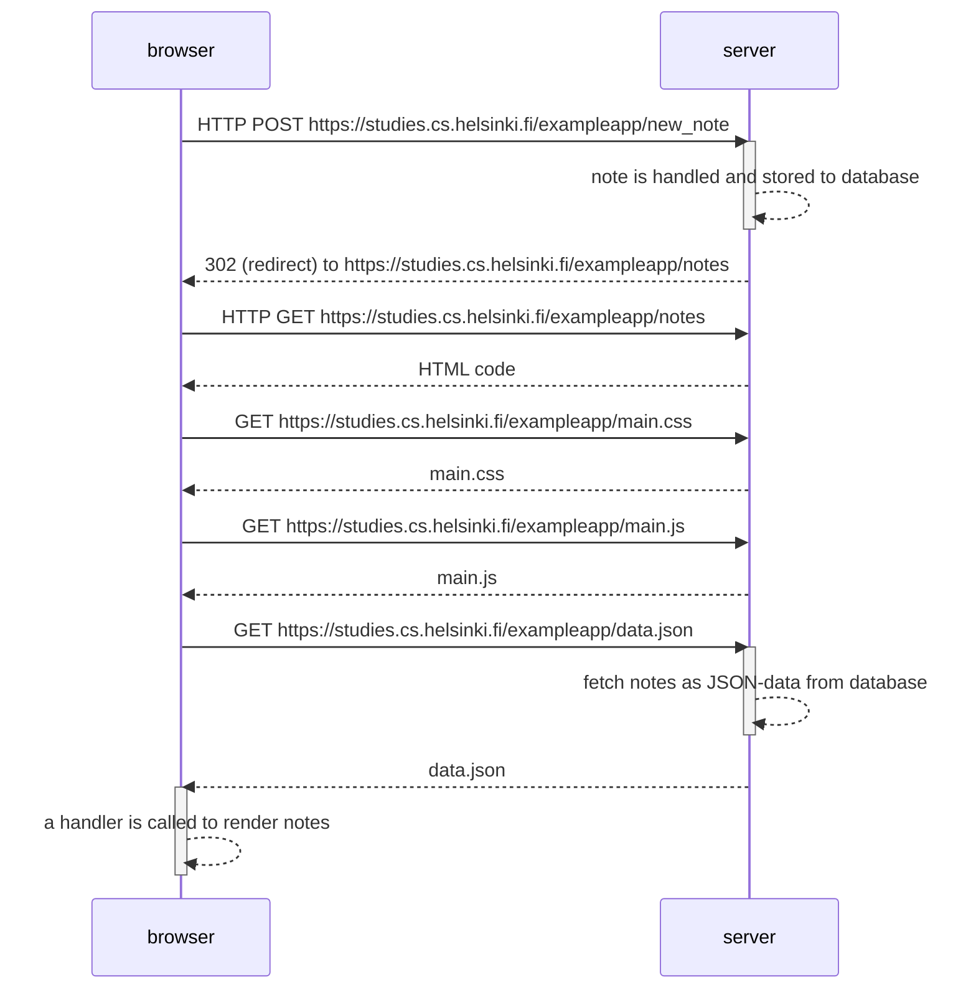

```mermaid
sequenceDiagram

participant browser
participant server

browser ->> server: HTTP POST https://studies.cs.helsinki.fi/exampleapp/new_note
activate server
server -->> server: note is handled and stored to database
deactivate server
server -->> browser: 302 (redirect) to https://studies.cs.helsinki.fi/exampleapp/notes
browser ->> server: HTTP GET https://studies.cs.helsinki.fi/exampleapp/notes
server -->> browser: HTML code
browser ->> server: GET https://studies.cs.helsinki.fi/exampleapp/main.css
server -->> browser: main.css
browser ->> server: GET https://studies.cs.helsinki.fi/exampleapp/main.js
server -->> browser: main.js
browser ->> server: GET https://studies.cs.helsinki.fi/exampleapp/data.json
activate server
server -->> server: fetch notes as JSON-data from database
deactivate server
server -->> browser: data.json
activate browser
browser -->> browser: a handler is called to render notes
deactivate browser
```