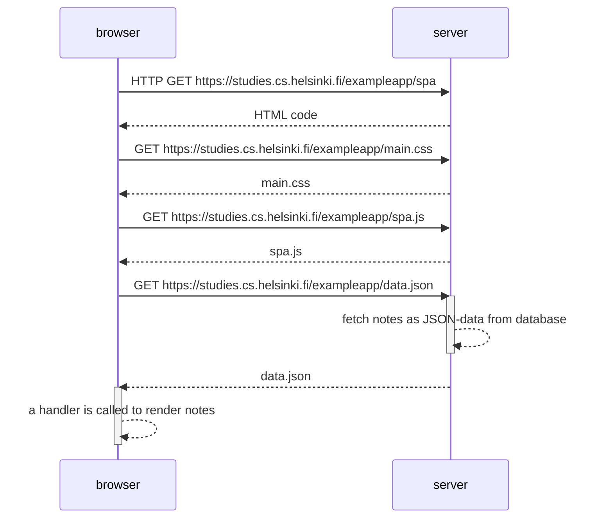

```mermaid
sequenceDiagram
participant browser
participant server
browser ->> server: HTTP GET https://studies.cs.helsinki.fi/exampleapp/spa
server -->> browser: HTML code
browser ->> server: GET https://studies.cs.helsinki.fi/exampleapp/main.css
server -->> browser: main.css
browser ->> server: GET https://studies.cs.helsinki.fi/exampleapp/spa.js
server -->> browser: spa.js
browser ->> server: GET https://studies.cs.helsinki.fi/exampleapp/data.json
activate server
server -->> server: fetch notes as JSON-data from database
deactivate server
server -->> browser: data.json
activate browser
browser -->> browser: a handler is called to render notes
deactivate browser
```