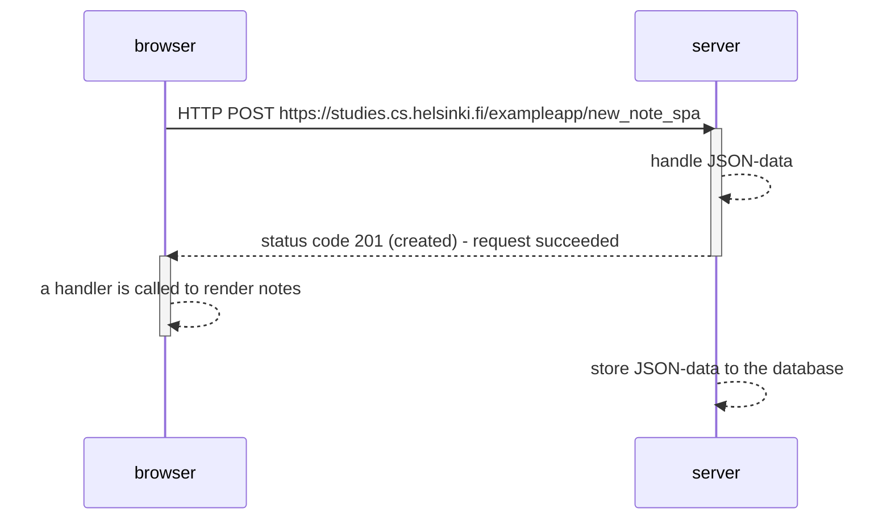

```mermaid
sequenceDiagram
participant browser
participant server
browser ->> server: HTTP POST https://studies.cs.helsinki.fi/exampleapp/new_note_spa

activate server
server -->> server: handle JSON-data
server -->> browser: status code 201 (created) - request succeeded
deactivate server
activate browser
browser -->> browser: a handler is called to render notes
deactivate browser
server -->> server: store JSON-data to the database
```